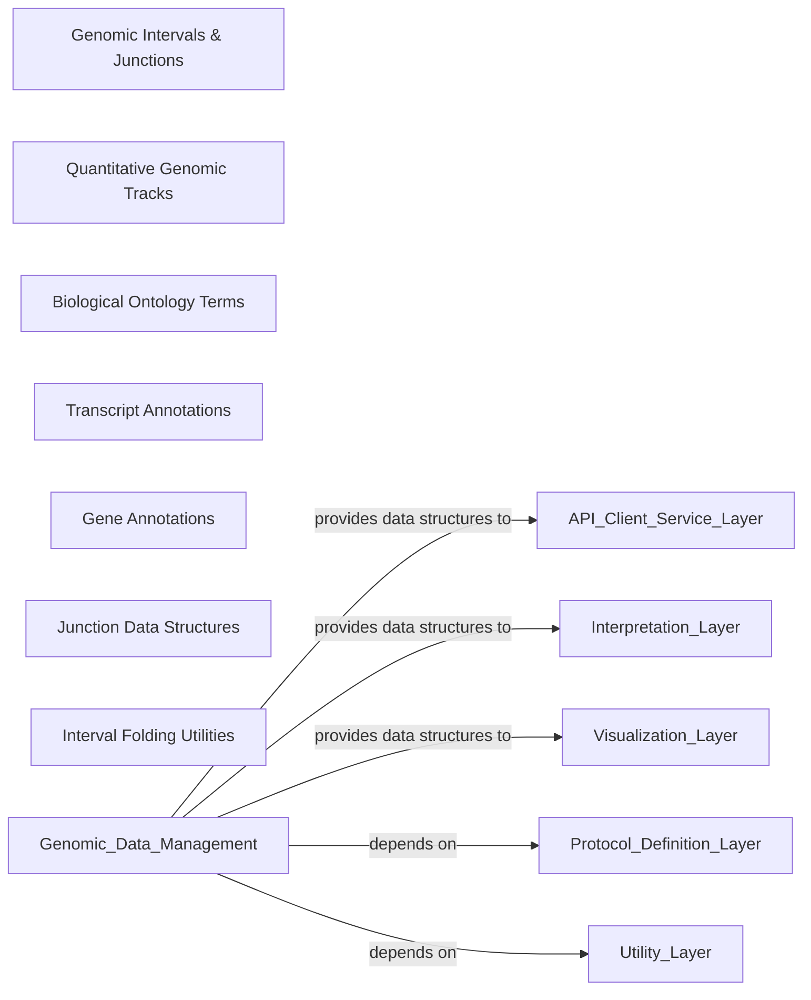

## Details

This foundational component, `Genomic Data Management`, is responsible for defining, managing, and providing core genomic data structures within the `alphagenome` SDK. It acts as the primary data layer, ensuring consistent representation and manipulation of genomic entities across the entire system. Its design emphasizes modularity, with each sub-component focusing on a specific type of genomic data or annotation. This component is fundamental because it provides the essential building blocks for all downstream analyses, model interactions, and visualizations, ensuring data integrity and facilitating interoperability within the SDK.

### Genomic Intervals & Junctions

Defines fundamental genomic coordinates and structures, including `Interval` (representing a contiguous genomic region) and `Junction` (representing a connection between two genomic intervals, often used for splice junctions). It provides the basic building blocks for all other genomic data types.

**Related Classes/Methods**:

- <a href="https://github.com/google-deepmind/alphagenome/blob/main/src/alphagenome/data/genome.py#L1-L1" target="_blank" rel="noopener noreferrer">`alphagenome.data.genome` (1:1)</a>

### Quantitative Genomic Tracks

Manages quantitative genomic data, such as read coverage, signal intensity, or conservation scores, typically represented as numerical values across genomic intervals. It provides structures for storing and accessing this data efficiently.

**Related Classes/Methods**:

- <a href="https://github.com/google-deepmind/alphagenome/blob/main/src/alphagenome/data/track_data.py#L1-L1" target="_blank" rel="noopener noreferrer">`alphagenome.data.track_data` (1:1)</a>

### Biological Ontology Terms

Defines and manages biological ontology terms, such as Gene Ontology (GO) terms or disease terms, allowing for the structured representation and categorization of biological concepts.

**Related Classes/Methods**:

- <a href="https://github.com/google-deepmind/alphagenome/blob/main/src/alphagenome/data/ontology.py#L1-L1" target="_blank" rel="noopener noreferrer">`alphagenome.data.ontology` (1:1)</a>

### Transcript Annotations

Handles the detailed annotation of transcripts, including exons, introns, and coding sequences, providing a structured representation of gene isoforms.

**Related Classes/Methods**:

- <a href="https://github.com/google-deepmind/alphagenome/blob/main/src/alphagenome/data/transcript.py#L1-L1" target="_blank" rel="noopener noreferrer">`alphagenome.data.transcript` (1:1)</a>

### Gene Annotations

Manages comprehensive gene annotations, including gene names, symbols, and associated genomic coordinates, providing a high-level view of gene organization.

**Related Classes/Methods**:

- <a href="https://github.com/google-deepmind/alphagenome/blob/main/src/alphagenome/data/gene_annotation.py#L1-L1" target="_blank" rel="noopener noreferrer">`alphagenome.data.gene_annotation` (1:1)</a>

### Junction Data Structures

Provides specialized data structures and utilities for handling and manipulating junction-specific information, often related to RNA splicing events.

**Related Classes/Methods**:

- <a href="https://github.com/google-deepmind/alphagenome/blob/main/src/alphagenome/data/junction_data.py#L1-L1" target="_blank" rel="noopener noreferrer">`alphagenome.data.junction_data` (1:1)</a>

### Interval Folding Utilities

Offers utilities for manipulating and "folding" genomic intervals, which can be used for operations like creating symmetric views around a central point or preparing data for specific model inputs.

**Related Classes/Methods**:

- <a href="https://github.com/google-deepmind/alphagenome/blob/main/src/alphagenome/data/fold_intervals.py#L1-L1" target="_blank" rel="noopener noreferrer">`alphagenome.data.fold_intervals` (1:1)</a>

### [FAQ](https://github.com/CodeBoarding/GeneratedOnBoardings/tree/main?tab=readme-ov-file#faq)