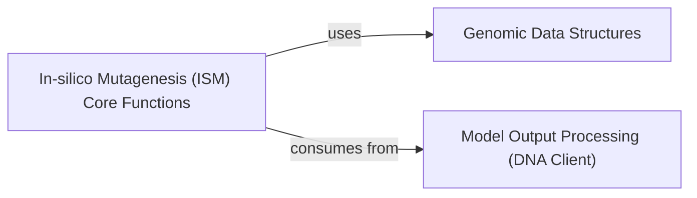

## Details

Component Overview: Interpretation & Analysis (`alphagenome.interpretation.ism`)

The `Interpretation & Analysis` component, specifically the `alphagenome.interpretation.ism` module, is dedicated to performing in-silico mutagenesis (ISM) analyses. It serves as a crucial bridge between raw model predictions and biological insights, by systematically generating and interpreting variant scores to understand the functional impact of genomic alterations.

### In-silico Mutagenesis (ISM) Core Functions

This component encapsulates the primary logic for generating single nucleotide variants and constructing in-silico mutagenesis matrices. It includes functions like `ism_variants` (for creating all possible single nucleotide variants within a genomic interval) and `ism_matrix` (for transforming variant effect scores into a structured matrix, highlighting the impact of mutations at each position).

**Related Classes/Methods**:

- `ism_variants`

- `ism_matrix`

### Genomic Data Structures

This component provides the fundamental data structures necessary to represent genomic entities, such as `Interval` (defining a genomic region) and `Variant` (describing a genomic alteration). These structures are essential for precisely defining the scope of ISM analysis and representing the mutations being studied.

**Related Classes/Methods**:

- `Interval`

- `Variant`

### Model Output Processing (DNA Client)

This component, residing in the `models` layer, is responsible for interacting with the underlying deep learning models (e.g., via a DNA client) to obtain predictions and generate variant scores. The `ism_matrix` function explicitly consumes "variant effect scores" which are derived from the output of these models, indicating a direct dependency.

**Related Classes/Methods**:

- `score_variants`

### [FAQ](https://github.com/CodeBoarding/GeneratedOnBoardings/tree/main?tab=readme-ov-file#faq)