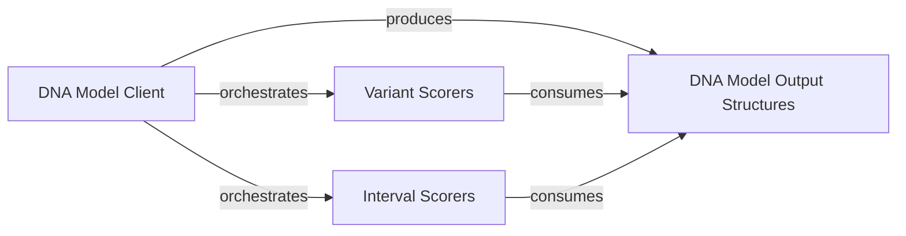

## Details

The `Model Client & Output Processing` subsystem is central to the AlphaGenome SDK, enabling interaction with remote DNA models and subsequent interpretation of their predictions.

### DNA Model Client

This component serves as the primary interface for interacting with remote AlphaGenome DNA models. It is responsible for constructing and executing gRPC requests, managing the communication lifecycle, and receiving raw model responses. It acts as the orchestrator for initiating model inference.

**Related Classes/Methods**:

- `DNA Model Client` (1:1)

### DNA Model Output Structures

This component defines the structured data types for encapsulating and organizing the raw predictions and scores received from the DNA models. It provides classes that represent the model's output in a standardized and accessible format for subsequent processing and analysis.

**Related Classes/Methods**:

- `DNA Model Output Structures` (1:1)

### Variant Scorers

This component comprises a collection of specialized algorithms and classes designed to calculate and aggregate scores for genomic variants based on the processed model outputs. These scorers apply specific biological or statistical logic to quantify the impact or significance of individual variants.

**Related Classes/Methods**:

- `Variant Scorers` (1:1)

### Interval Scorers

This component provides functionalities to calculate and aggregate scores for genomic intervals. It includes classes that process model predictions over defined genomic regions, offering an interval-level assessment of model outputs.

**Related Classes/Methods**:

- `Interval Scorers` (1:1)

### [FAQ](https://github.com/CodeBoarding/GeneratedOnBoardings/tree/main?tab=readme-ov-file#faq)