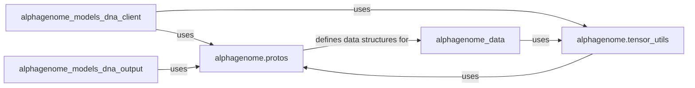

## Details

This component is fundamental to the `alphagenome` SDK, serving as the backbone for efficient and structured data exchange, particularly for gRPC-based communication with the backend. It ensures data consistency, integrity, and optimized transfer performance.

### alphagenome.protos

This sub-component encapsulates the auto-generated Python classes derived from Protocol Buffer (`.proto`) definitions. These definitions serve as the canonical data schemas for all inter-process communication within the SDK and with external services (e.g., the gRPC backend). They define the structure of genomic entities, model inputs, model outputs, and service contracts, ensuring type safety and efficient serialization/deserialization.

**Related Classes/Methods**:

- `alphagenome.protos.dna_model_pb2` (1:1)

- `alphagenome.protos.dna_model_service_pb2` (1:1)

- `alphagenome.protos.tensor_pb2` (1:1)

- `alphagenome.protos.tensor_pb2_grpc` (1:1)

### alphagenome.tensor_utils

This sub-component provides a suite of utility functions specifically designed for the efficient handling of tensor data. Its primary responsibilities include converting NumPy arrays to and from the Protocol Buffer `TensorProto` format, and implementing compression/decompression mechanisms (e.g., using `zstandard`) to minimize data transfer size and latency for large tensor payloads.

**Related Classes/Methods**:

- <a href="https://github.com/google-deepmind/alphagenome/blob/main/src/alphagenome/tensor_utils.py#L1-L1" target="_blank" rel="noopener noreferrer">`alphagenome.tensor_utils` (1:1)</a>

### [FAQ](https://github.com/CodeBoarding/GeneratedOnBoardings/tree/main?tab=readme-ov-file#faq)