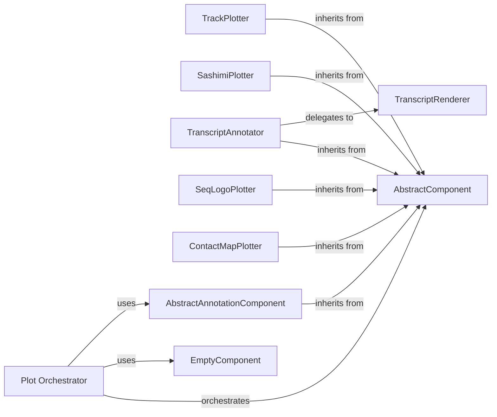

## Details

The `Visualization` component in `alphagenome` provides a robust and extensible framework for generating diverse genomic data visualizations. It adheres to a modular design, leveraging abstract base classes and concrete implementations to offer both low-level plotting primitives and high-level, reusable components for complex genomic plots.

### AbstractComponent

This is the foundational abstract base class for all visual components within the `alphagenome.visualization` module. It defines the common interface and properties that all concrete plotting components must implement, ensuring consistency and extensibility. It's crucial for enabling polymorphism and a plug-and-play architecture for different plot types.

**Related Classes/Methods**:

- `AbstractComponent`

### Plot Orchestrator

This is the primary entry point for users to construct complex visualizations. It orchestrates the rendering of multiple `AbstractComponent` instances onto a single `matplotlib` figure, managing layout, titles, and annotations. It acts as the high-level API for combining various genomic plot elements.

**Related Classes/Methods**:

- <a href="https://github.com/google-deepmind/alphagenome/blob/main/src/alphagenome/visualization/plot.py" target="_blank" rel="noopener noreferrer">`plot`</a>

### TrackPlotter

A concrete implementation of `AbstractComponent` designed for visualizing generic genomic tracks. This includes data like read coverage, signal data, or any quantitative data across a genomic interval. It provides the functionality to render these tracks within the orchestrated plot.

**Related Classes/Methods**:

- `Tracks`

### SashimiPlotter

A specialized concrete implementation of `AbstractComponent` for visualizing splicing events. It displays read coverage and junction counts, which are critical for analyzing gene expression and alternative splicing.

**Related Classes/Methods**:

- `Sashimi`

### TranscriptAnnotator

A concrete implementation of `AbstractComponent` dedicated to annotating and visualizing gene transcripts, including the detailed structure of exons and introns. It provides a visual representation of gene models within the genomic context.

**Related Classes/Methods**:

- `TranscriptAnnotation`

### SeqLogoPlotter

A concrete implementation of `AbstractComponent` for generating sequence logo plots. These plots are used to represent sequence conservation and identify consensus sequences, particularly useful in analyzing binding sites or motifs.

**Related Classes/Methods**:

- `SeqLogo`

### ContactMapPlotter

A concrete implementation of `AbstractComponent` for visualizing genomic contact maps, typically used in Hi-C data analysis to show the spatial proximity of genomic regions.

**Related Classes/Methods**:

- `ContactMaps`

### AbstractAnnotationComponent

An abstract base class that extends `AbstractComponent`, specifically designed for various types of annotations that can be overlaid on genomic plots. This allows for a structured way to add features like interval highlights or variant markers.

**Related Classes/Methods**:

- `AbstractAnnotation`

### TranscriptRenderer

A lower-level utility function responsible for the detailed drawing of individual transcripts, including their exons and introns. While not a `plot_component` itself, it serves as a crucial helper for the `TranscriptAnnotator` component, handling the intricate rendering logic.

**Related Classes/Methods**:

- <a href="https://github.com/google-deepmind/alphagenome/blob/main/src/alphagenome/visualization/plot_transcripts.py#L90-L163" target="_blank" rel="noopener noreferrer">`plot_transcripts` (90:163)</a>

### EmptyComponent

A specialized concrete implementation of `AbstractComponent` used internally by the `Plot Orchestrator`. Its primary purpose is to create an empty axis at the top of the plot, specifically for placing labels from annotation components, ensuring proper layout and avoiding overlaps.

**Related Classes/Methods**:

- `EmptyComponent`

### [FAQ](https://github.com/CodeBoarding/GeneratedOnBoardings/tree/main?tab=readme-ov-file#faq)