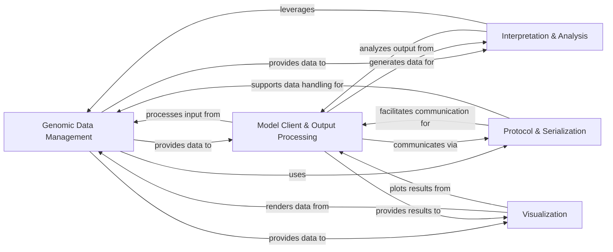

## Details

The `alphagenome` project, designed as a Python SDK for bioinformatics and deep learning in genomics, exhibits a clear modular and layered architecture. The analysis consolidates the identified components into five core logical units, ensuring a high-level data flow overview that aligns with typical SDK patterns.

### Genomic Data Management [[Expand]](./Genomic_Data_Management.md)

This foundational component defines and manages all core genomic entities, including intervals, variants, junctions, and quantitative genomic track data. It also handles biological ontology terms, gene, and transcript annotations. It provides utilities for data manipulation, serialization/deserialization, and preparing data for subsequent processing or visualization.

**Related Classes/Methods**:

- <a href="https://github.com/google-deepmind/alphagenome/blob/main/src/alphagenome/data/genome.py" target="_blank" rel="noopener noreferrer">`alphagenome.data.genome`</a>

- <a href="https://github.com/google-deepmind/alphagenome/blob/main/src/alphagenome/data/track_data.py" target="_blank" rel="noopener noreferrer">`alphagenome.data.track_data`</a>

- <a href="https://github.com/google-deepmind/alphagenome/blob/main/src/alphagenome/data/junction_data.py" target="_blank" rel="noopener noreferrer">`alphagenome.data.junction_data`</a>

- <a href="https://github.com/google-deepmind/alphagenome/blob/main/src/alphagenome/data/ontology.py" target="_blank" rel="noopener noreferrer">`alphagenome.data.ontology`</a>

- <a href="https://github.com/google-deepmind/alphagenome/blob/main/src/alphagenome/data/transcript.py" target="_blank" rel="noopener noreferrer">`alphagenome.data.transcript`</a>

- <a href="https://github.com/google-deepmind/alphagenome/blob/main/src/alphagenome/data/gene_annotation.py" target="_blank" rel="noopener noreferrer">`alphagenome.data.gene_annotation`</a>

- <a href="https://github.com/google-deepmind/alphagenome/blob/main/src/alphagenome/data/fold_intervals.py" target="_blank" rel="noopener noreferrer">`alphagenome.data.fold_intervals`</a>

### Protocol & Serialization [[Expand]](./Protocol_Serialization.md)

This component is responsible for defining the structured data formats (using Protocol Buffers) for efficient inter-process communication, primarily for gRPC interactions with the backend. It also includes utilities for packing, unpacking, compressing, and decompressing tensor data, optimizing data transfer efficiency.

**Related Classes/Methods**:

- `alphagenome.protos`

- <a href="https://github.com/google-deepmind/alphagenome/blob/main/src/alphagenome/tensor_utils.py" target="_blank" rel="noopener noreferrer">`alphagenome.tensor_utils`</a>

### Model Client & Output Processing [[Expand]](./Model_Client_Output_Processing.md)

This is the primary client-side interface for interacting with remote AlphaGenome DNA models. It handles the construction and execution of gRPC requests, receiving responses, and then structuring and processing the model predictions and scores. This includes functionalities for scoring genomic variants and intervals based on model outputs.

**Related Classes/Methods**:

- <a href="https://github.com/google-deepmind/alphagenome/blob/main/src/alphagenome/models/dna_client.py" target="_blank" rel="noopener noreferrer">`alphagenome.models.dna_client`</a>

- <a href="https://github.com/google-deepmind/alphagenome/blob/main/src/alphagenome/models/dna_output.py" target="_blank" rel="noopener noreferrer">`alphagenome.models.dna_output`</a>

- <a href="https://github.com/google-deepmind/alphagenome/blob/main/src/alphagenome/models/variant_scorers.py" target="_blank" rel="noopener noreferrer">`alphagenome.models.variant_scorers`</a>

- <a href="https://github.com/google-deepmind/alphagenome/blob/main/src/alphagenome/models/interval_scorers.py" target="_blank" rel="noopener noreferrer">`alphagenome.models.interval_scorers`</a>

### Interpretation & Analysis [[Expand]](./Interpretation_Analysis.md)

This component implements advanced computational biology analyses, with a specific focus on in-silico mutagenesis (ISM). It consumes processed model outputs to systematically generate and interpret variant scores, providing crucial insights into the functional impact of genomic alterations.

**Related Classes/Methods**:

- <a href="https://github.com/google-deepmind/alphagenome/blob/main/src/alphagenome/interpretation/ism.py" target="_blank" rel="noopener noreferrer">`alphagenome.interpretation.ism`</a>

### Visualization [[Expand]](./Visualization.md)

This component offers a comprehensive suite of tools for visualizing genomic data and model predictions. It includes both low-level plotting primitives and high-level, reusable components for constructing complex genomic plots, such as track views, sashimi plots, and detailed transcript annotations.

**Related Classes/Methods**:

- <a href="https://github.com/google-deepmind/alphagenome/blob/main/src/alphagenome/visualization/plot.py" target="_blank" rel="noopener noreferrer">`alphagenome.visualization.plot`</a>

- <a href="https://github.com/google-deepmind/alphagenome/blob/main/src/alphagenome/visualization/plot_components.py" target="_blank" rel="noopener noreferrer">`alphagenome.visualization.plot_components`</a>

- <a href="https://github.com/google-deepmind/alphagenome/blob/main/src/alphagenome/visualization/plot_transcripts.py#L90-L163" target="_blank" rel="noopener noreferrer">`alphagenome.visualization.plot_transcripts` (90:163)</a>

### [FAQ](https://github.com/CodeBoarding/GeneratedOnBoardings/tree/main?tab=readme-ov-file#faq)